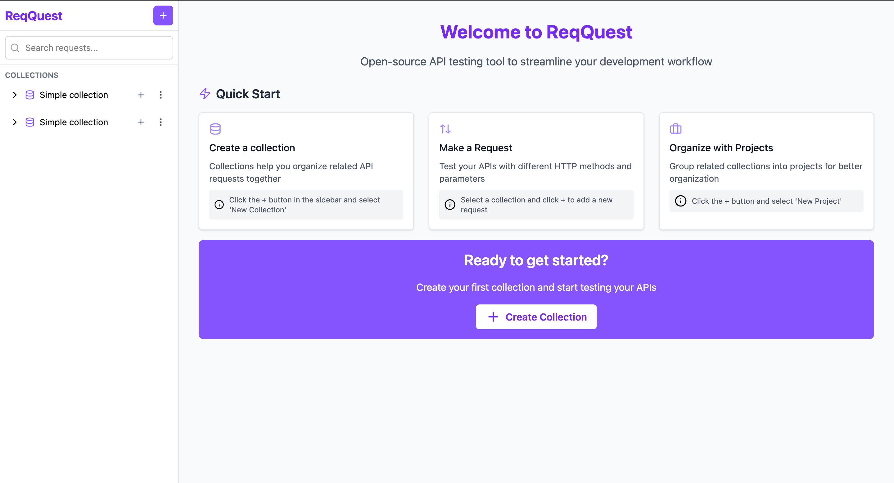

# ReqQuest
🚀 ReqQuest is an open-source web application that streamlines API testing by providing an intuitive platform for managing HTTP requests.



## 🖥️ Technologies

- **React 18** - A JavaScript library for building user interfaces
- **TypeScript** - For type-safe code
- **Vite** - A frontedn build tool
- **TanStack Router** - Type-safe routing for React
- **Tailwind CSS** - A utility-first CSS framework
- **Zustand** - A small, fast and scalable state management solution
- **Lucide Icons** - Beautiful & consistent icons

## 🎨 Design

The UI of this application was designed with the assistance of V0 by Vercel, an AI-powered design tool.

## 📋 Prerequisites

Before you begin, ensure you have the following installed:

- Node.js (version 18.0.0 or higher)
- npm (version 8.0.0 or higher)

## 🛠️ Installation

1. Clone the repository:

```bash
git clone <repository-url>
cd req-quest
```

2. Install dependencies:

```bash
npm install
```

3. Start the development server:

```bash
npm run dev
```

The application will be available at `http://localhost:5173`

## 🤝 Contributing

Contributions are welcome! Please feel free to submit a Pull Request.

## 👥 Authors

- Alexander Rangelov - [Github](https://github.com/arangelovv)
